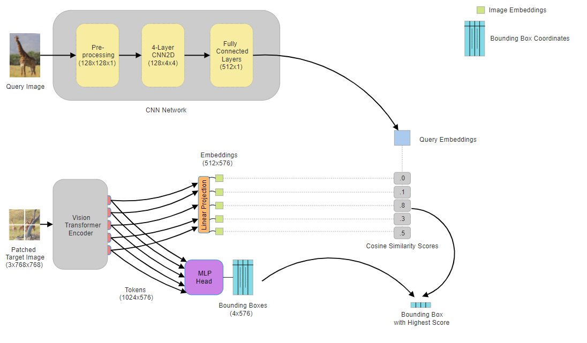
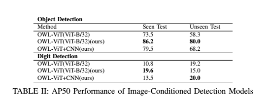

Image-Guided Object Detection using OWL-ViT and Enhanced Query Embedding Extraction
==


OWL-ViT is an **image-guided object detector**, as well as an **open-vocabulary object detector**. Given an image and a visual query, it finds objects matching that query in the image.

[[OWL-ViT+CNN Paper]](https://arxiv.org/abs/2306.09683)
[[Training Code Colab]](https://colab.research.google.com/drive/1wsms9mcqSTqUJCNuM4AyMZBrXwiz2BGn?usp=drive_link)


## Contents
Below, we provide pretrained checkpoints, example training code in Colab.

To get started, check out the [Training Code Colab](https://colab.research.google.com/drive/1wsms9mcqSTqUJCNuM4AyMZBrXwiz2BGn?usp=drive_link), which shows all steps necessary for running training process, including installing necessary libraries, instantiating a model, loading a checkpoint, preprocessing input images, getting predictions, and saving them.

Table of contents:

* [Model](#model)
* [Pretrained checkpoints](#pretrained-checkpoints)
* [Datasets](#datasets)
* [Training Code Colab](#colabs)
* [Reference](#reference)

## Model versions

### OWL-ViT+CNN
The original OWL-ViT model was introduced in May 2022 and is described in [Simple Open-Vocabulary Object Detection with Vision Transformers](https://arxiv.org/abs/2205.06230). In June 2023, we introduced an improved architecture and training recipe that uses self-training on Web image-text data as described in [Scaling Open-Vocabulary Object Detection](https://arxiv.org/abs/2306.09683). In this study, a new query embedding extractor network is defined to adapt the model for the given task better.

The performances:




## Pretrained checkpoints

Pre-trained checkpoints of the proposed query embedding network are specified in [configuration files](https://github.com/melihsrn/OWL-ViT_with_enhanced_query_embedding_network/query_embed_network/). 

## Datasets

You can reach through these links: [Object Detection Dataset](https://drive.google.com/drive/folders/1PseY_87Ks8PrSx9aP5HQxHOE2UYw_tY0?usp=sharing) and [Digit Detection Dataset](https://drive.google.com/drive/folders/1tjb7aveWefg6bZhMZHffMYw-Tqp3EOQx?usp=sharing)

## Training Code Colab

The [Training Code Colab](https://colab.research.google.com/drive/1wsms9mcqSTqUJCNuM4AyMZBrXwiz2BGn?usp=drive_link) shows all steps necessary for running training process, including installing necessary libraries, instantiating a model, loading a checkpoint, preprocessing input images, getting predictions, and saving them. You just need to change the locations according to the locations in your local environment.

## Reference
If you use OWL-ViT+CNN, please cite the paper as appropriate:

### OWL-ViT+CNN
```
@article{owl_vit_plus_cnn,
  title={Image-Guided Object Detection using OWL-ViT and Enhanced Query Embedding Extraction},
  author={Melih Serin},
  year={2024},
}
```
